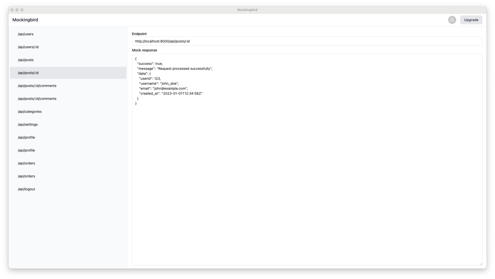

# MockingBird

MockingBird is a desktop application built with Electron.js, React, TypeScript, and Tailwind CSS. It allows you to easily create mock APIs for local development, providing a convenient way to simulate various endpoints and responses.

## Features

- **User-Friendly Interface:** Intuitive and easy-to-use graphical interface for creating and managing mock APIs.
- **Customizable Endpoints:** Define custom endpoints with specific HTTP methods, request/response headers, and payloads.
- **Dynamic Responses:** Generate dynamic responses using JavaScript, making it easy to simulate different scenarios.
- **Persistent Storage:** Save and load mock API configurations for reuse across different projects.
- **Real-time Preview:** Instantly preview your mock APIs as you create or modify them.

## Technologies Used

- **Electron.js:** Cross-platform desktop application framework.
- **React:** A JavaScript library for building user interfaces.
- **TypeScript:** Adds static typing to JavaScript, enhancing code quality and developer productivity.
- **Tailwind CSS:** A utility-first CSS framework for quickly styling your application.

## Getting Started

### Prerequisites

- [Node.js](https://nodejs.org/) (v16 or later)
- [npm](https://www.npmjs.com/) (comes with Node.js)

### Installation

1. Clone the repository: `git clone https://github.com/appcubedev/mockingbird.git`
2. Navigate to the project directory: `cd mockingbird`
3. Install dependencies: `npm install`
4. Start the application: `npm start`

## Usage

1. Open MockingBird application.
2. Create a new project or load an existing one.
3. Define your mock APIs with the provided interface.
4. Save and use the generated endpoints in your local development environment.

## Contributing

If you'd like to contribute to MockingBird, please follow the [contribution guidelines](./docs/CONTRIBUTING.md).

## License

This project is licensed under the [MIT License](LICENSE.md).
